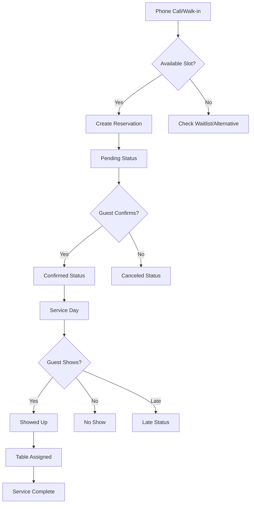
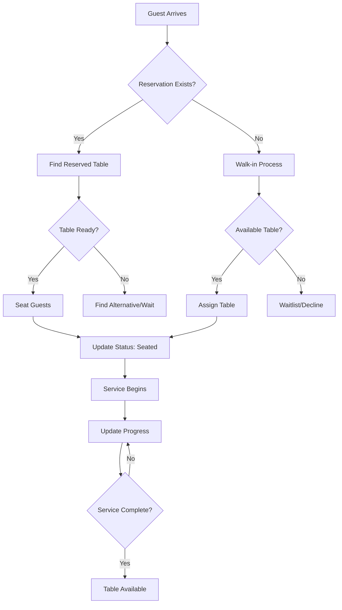

# SeatKit - Business Domain Model

> **Restaurant Operations Analysis & Requirements**
> **Context**: Japanese-Venetian Restaurant (Koenji) - 18-20 seats total
> **Last Updated**: 2025-10-25

---

## 🏪 Restaurant Operations Overview

### Physical Layout
```
Koenji Restaurant Layout:
┌─────────────────────────────────┐
│  DINING ROOM (14 seats)         │
│  ┌─┐ ┌─┐ ┌─┐ ┌─┐              │
│  │2│ │2│ │4│ │2│  Tables        │
│  └─┘ └─┘ └─┘ └─┘              │
│  ┌─┐ ┌─┐                       │
│  │2│ │2│                       │
│  └─┘ └─┘                       │
│                                 │
│  COUNTER BAR (4-6 seats)        │
│  ████████████████████           │
│  Counter with sake/wine         │
└─────────────────────────────────┘

Total Capacity: 18-20 guests
Peak Times: Lunch (12:00-14:00), Dinner (19:00-22:00)
```

### Business Characteristics
- **High-Turnover**: Multiple seatings per service (lunch/dinner)
- **Small Footprint**: Every seat counts, no wasted space
- **Quality Focus**: Mid-range dining, not fast-casual
- **Beverage Program**: Japanese sake + natural wines (specialized knowledge required)
- **Service Style**: Attentive but efficient, personal but professional

---

## 👥 User Personas & Workflows

### 1. Host/Hostess - "The Traffic Controller"
**Role**: Manages incoming reservations, seating decisions, guest experience

**Daily Workflow**:
```
08:00-10:00  Review day's reservations, spot conflicts
10:00-11:30  Take phone reservations for lunch
11:30-15:00  LUNCH SERVICE - seat guests, manage waits
15:00-18:00  Take dinner reservations, prep for evening
18:00-23:00  DINNER SERVICE - seat guests, manage flow
23:00-24:00  Review day, enter any final changes
```

**Key Pain Points**:
- Phone rings during busy service → need quick reservation lookup
- Walk-ins when fully booked → need to see real availability
- Table turns faster/slower than expected → need flexible timing
- Multiple staff asking "what time is table 4 available?" → need real-time info

**Success Metrics**:
- Minimize guest wait times
- Maximize table utilization
- Reduce "we're full" when tables are actually available

### 2. Server - "The Table Manager"
**Role**: Manages assigned tables, guest requests, service timing

**Key Interactions with System**:
- Check reservation details (dietary restrictions, special occasions)
- Update table status (seated, ordered, main course, dessert, bill)
- Handle guest requests (move tables, extend time, add people)
- Coordinate with kitchen on timing

**Critical Needs**:
- Quick access to guest information
- Easy status updates (one-tap preferred)
- Visibility into other servers' tables (for help/coordination)

### 3. Manager - "The Operations Optimizer"
**Role**: Oversees service, handles complex situations, analyzes performance

**Key Workflows**:
- **Pre-Service**: Review reservations, staffing, special needs
- **During Service**: Handle conflicts, approve changes, monitor flow
- **Post-Service**: Enter sales data, review performance, plan improvements

**Authority Levels**:
- Can override system restrictions
- Can modify/cancel any reservation
- Exclusive access to sales data entry
- Can see all staff activities and edit history

### 4. Owner - "The Business Strategist"
**Role**: Understands business performance, makes strategic decisions

**Analytics Needs**:
- Daily/weekly/monthly sales trends
- Table utilization patterns
- Peak hours analysis
- Seasonal variations
- Comparison to previous periods

---

## 🎯 Core Business Entities

### Reservation Entity
The heart of the system - represents a guest booking

```typescript
interface Reservation {
  // Identity
  id: string;

  // Guest Information
  name: string;
  phone: string;
  numberOfPersons: number;

  // Timing
  dateString: string;        // "2025-10-25"
  startTime: string;         // "19:30"
  endTime?: string;          // "21:00" (calculated or manual)

  // Classification
  category: 'lunch' | 'dinner' | 'noBookingZone';
  type: 'walkIn' | 'inAdvance' | 'waitingList';

  // Status Management
  status: 'pending' | 'confirmed' | 'canceled' | 'noShow' |
          'showedUp' | 'late' | 'toHandle' | 'deleted';
  acceptance: 'confirmed' | 'toConfirm' | 'na';

  // Special Information
  specialRequests?: string;
  dietaryRestrictions?: string;
  language?: 'italian' | 'english' | 'japanese';

  // Visual/UX
  colorHue?: number;         // For visual distinction

  // System Metadata
  createdAt: Date;
  lastEdited: Date;
  editedBy?: string;
}
```

**Business Rules**:
- **Timing**: Lunch slots 12:00-15:00, Dinner slots 19:00-23:00
- **Duration**: Default 2 hours, adjustable by staff
- **Party Size**: 1-6 people (larger parties need special handling)
- **Lead Time**: Same-day reservations allowed, advance booking encouraged
- **Cancellation**: 2-hour notice preferred, flexible for regulars

### Table Entity
Physical restaurant tables with capacity and positioning

```typescript
interface Table {
  // Identity
  id: string;
  name: string;              // "Table 1", "Bar Seat 3"

  // Capacity
  minCapacity: number;       // Minimum comfortable seating
  maxCapacity: number;       // Maximum possible seating

  // Physical Properties
  position: { row: number; column: number };
  isVisible: boolean;        // Can be hidden for maintenance

  // Relationships
  adjacentTables?: string[]; // Can be combined for larger parties
  cluster?: string;          // Tables that work together

  // Metadata
  notes?: string;            // "Window table", "Near kitchen"
  type: 'dining' | 'bar' | 'private';
}
```

**Table Assignment Logic**:
1. **Best Fit**: Match party size to table capacity (avoid waste)
2. **Time Optimization**: Consider turnover and next reservations
3. **Guest Preference**: Window seats, bar vs dining, accessibility
4. **Operational Efficiency**: Server stations, kitchen proximity

### Sales Entity
Financial tracking for business performance

```typescript
interface SaleCategory {
  id: string;
  date: string;
  type: 'lunch' | 'dinner';

  // Core Sales Metrics
  letturaCassa: number;      // Cash register reading
  fatture: number;           // Invoice total
  yami: number;              // Food waste (cost)
  yamiPulito: number;        // Net waste (after adjustments)

  // Service-Specific Metrics
  bento?: number;            // Lunch special sales (lunch only)
  cocai?: number;            // Dinner cocktails (dinner only)
  persone?: number;          // Guest count (lunch only)

  // Calculated Fields
  totalSales: number;        // Computed from core metrics
  averageSpend?: number;     // Total / guest count (when available)

  // Metadata
  enteredBy: string;
  enteredAt: Date;
  modifiedBy?: string;
  modifiedAt?: Date;
}
```

**Sales Business Rules**:
- **Entry Timing**: Data entered at end of each service
- **Authorization**: Only managers can enter/edit sales data
- **Validation**: Totals must reconcile with POS system
- **Reporting**: Daily, weekly, monthly, yearly aggregations

### Session Entity
Active user sessions for collaboration

```typescript
interface Session {
  id: string;
  userId: string;
  userName: string;

  // Device Information
  deviceName: string;
  deviceType: 'mobile' | 'desktop' | 'tablet';

  // Activity State
  isActive: boolean;
  isEditing: boolean;
  editingEntity?: {
    type: 'reservation' | 'table' | 'sales';
    id: string;
  };

  // Timestamps
  loginTime: Date;
  lastActivity: Date;

  // UI State
  currentView: 'timeline' | 'list' | 'layout' | 'sales';
  profileImageURL?: string;
}
```

**Collaboration Rules**:
- **Conflict Prevention**: Show who's editing what entity
- **Timeout**: Auto-logout after 30 minutes of inactivity
- **Multi-Device**: Same user can be active on multiple devices
- **Real-Time**: All sessions see live updates from others

### Profile Entity
User accounts and preferences

```typescript
interface Profile {
  id: string;              // Apple ID or generated UUID

  // Personal Information
  firstName: string;
  lastName: string;
  email: string;
  phone?: string;

  // Role & Permissions
  role: 'staff' | 'manager' | 'owner';
  permissions: {
    canEditReservations: boolean;
    canDeleteReservations: boolean;
    canAccessSales: boolean;
    canEditSales: boolean;
    canManageUsers: boolean;
  };

  // Preferences
  language: 'italian' | 'english' | 'japanese';
  defaultView: 'timeline' | 'list' | 'layout';
  notifications: {
    reservationChanges: boolean;
    salesReminders: boolean;
    systemUpdates: boolean;
  };

  // Visual
  profileImageURL?: string;
  avatarColor?: string;

  // System
  devices: Device[];
  createdAt: Date;
  lastLogin: Date;
  isActive: boolean;
}
```

---

## 🔄 Business Processes

### 1. Reservation Lifecycle



**State Transitions**:
- `pending` → `confirmed` (guest confirms)
- `pending` → `canceled` (guest cancels)
- `confirmed` → `showedUp` (guest arrives)
- `confirmed` → `noShow` (guest doesn't arrive)
- `confirmed` → `late` (guest arrives >15min late)
- `showedUp` → `deleted` (service complete, archived)

### 2. Table Management Process



### 3. Daily Operations Cycle

**Pre-Service Preparation**:
1. Review day's reservations
2. Check for special requests/dietary needs
3. Identify potential overbookings or gaps
4. Brief staff on VIP guests or large parties
5. Configure system for service period

**During Service**:
1. Seat guests according to reservations
2. Handle walk-ins and changes
3. Monitor table turnover timing
4. Update reservation statuses
5. Coordinate with kitchen on timing

**Post-Service Cleanup**:
1. Mark no-shows and late arrivals
2. Enter sales data
3. Archive completed reservations
4. Review day's performance
5. Plan for next service

---

## 📊 Business Intelligence Requirements

### Key Performance Indicators (KPIs)

**Revenue Metrics**:
- Daily/Weekly/Monthly sales totals
- Average spend per person
- Sales by service (lunch vs dinner)
- Beverage vs food ratio
- Seasonal trends and patterns

**Operational Metrics**:
- Table utilization rate (occupied vs available hours)
- Average table turn time
- Reservation conversion rate (pending → confirmed)
- No-show percentage
- Walk-in vs advance booking ratio

**Guest Experience Metrics**:
- Average wait time for walk-ins
- Time from reservation to seating
- Special request fulfillment rate
- Repeat guest frequency
- Guest satisfaction indicators

### Reporting Requirements

**Daily Reports** (End of Service):
- Sales summary by category
- Reservation statistics
- Table utilization
- Staff performance notes

**Weekly Reports** (Management Review):
- Trend analysis vs previous week
- Peak hour identification
- Inventory waste tracking
- Staff scheduling optimization

**Monthly Reports** (Business Planning):
- Financial performance vs goals
- Seasonal pattern analysis
- Customer behavior insights
- Operational improvement opportunities

---

## ⚡ Real-Time Collaboration Requirements

### Multi-User Scenarios

**High-Frequency Conflicts**:
- Multiple staff updating same reservation (guest calls to change, server updates status)
- Table assignments during busy periods (who gets the next 2-top?)
- Walk-in management (is table 4 really available?)

**Conflict Resolution Strategy**:
- **Optimistic Locking**: Allow edits, detect conflicts, prompt resolution
- **Last-Writer-Wins**: For simple updates (status changes)
- **Manager Override**: Managers can resolve any conflict
- **Audit Trail**: Track all changes with timestamp and user

### Real-Time Update Priorities

**Critical (Immediate Propagation)**:
- Reservation status changes
- Table availability updates
- Guest arrival notifications
- Cancellations and no-shows

**Important (Within 5 seconds)**:
- Special request updates
- Guest count changes
- Timing modifications
- Staff notes additions

**Low Priority (Within 30 seconds)**:
- Profile updates
- System configuration changes
- Historical data corrections

---

## 🎨 User Experience Priorities

### Mobile-First Design (Staff Phones)
- **Quick Actions**: Common operations accessible in 2-3 taps
- **Large Targets**: Touch-friendly buttons and controls
- **Offline Resilience**: Critical functions work without internet
- **Battery Efficient**: Minimize background processing

### Desktop Enhancement (Manager Stations)
- **Multiple Views**: Split-screen timeline + list views
- **Keyboard Shortcuts**: Power user efficiency
- **Detailed Analytics**: Charts, graphs, detailed reports
- **Bulk Operations**: Select multiple reservations for changes

### Cross-Platform Consistency
- **Data Sync**: Changes on phone immediately visible on desktop
- **UI Patterns**: Similar workflows across devices
- **Feature Parity**: Core functions available everywhere
- **Context Switching**: Seamless handoff between devices

---

## 🔧 Configuration Requirements

### Restaurant Setup
```typescript
interface RestaurantConfig {
  // Basic Information
  name: string;
  address: string;
  phone: string;
  email: string;

  // Operating Hours
  hours: {
    [day: string]: {
      lunch?: { open: string; close: string; };
      dinner?: { open: string; close: string; };
      closed?: boolean;
    };
  };

  // Reservation Settings
  reservationPolicy: {
    advanceBookingDays: number;     // How far ahead to allow bookings
    minimumNoticeHours: number;     // Same-day booking cutoff
    defaultDurationMinutes: number; // Standard reservation length
    maxPartySize: number;           // Largest party without approval

    // Time Slots
    lunchSlots: string[];           // Available lunch times
    dinnerSlots: string[];          // Available dinner times

    // Policies
    allowWalkIns: boolean;
    requirePhone: boolean;
    requireEmail: boolean;
  };

  // Table Configuration
  tables: Table[];

  // Sales Categories
  salesCategories: {
    lunch: string[];                // What to track for lunch
    dinner: string[];               // What to track for dinner
  };

  // Staff Permissions
  defaultPermissions: {
    [role: string]: PermissionSet;
  };
}
```

### Multi-Restaurant Vision
Future support for restaurant groups:
- Shared staff across locations
- Consolidated reporting
- Brand consistency with local customization
- Cross-location reservations and transfers

---

This domain model forms the foundation for all technical decisions and feature development. It represents the real-world complexity of restaurant operations while providing clear structure for the TypeScript implementation.