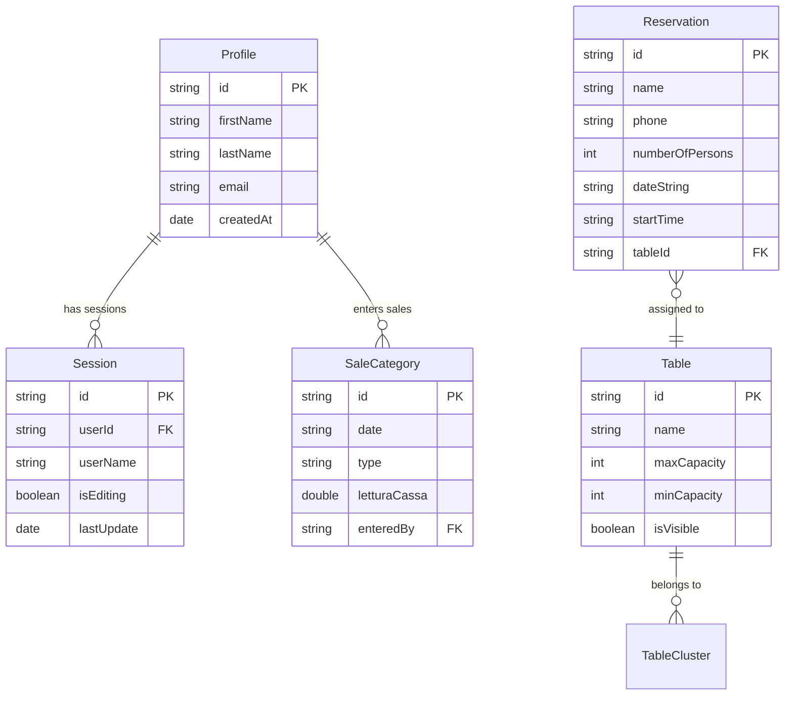

# Swift App - Data Models Analysis

> **Source**: KoenjiApp Swift iOS application domain models
> **Purpose**: Complete type mapping for TypeScript migration
> **Analysis Focus**: Core entities, enums, relationships, and business rules
> **Last Updated**: 2025-10-25

---

## 🎯 Core Domain Models

### Reservation Model (Primary Entity)

**Swift Implementation**:

```swift
struct Reservation: Codable, Identifiable, Hashable, Equatable {
    // MARK: - Identity
    let id: String

    // MARK: - Guest Information
    var name: String
    var phone: String
    var numberOfPersons: Int

    // MARK: - Timing
    var dateString: String        // Format: "2025-10-25"
    var startTime: String         // Format: "19:30"
    var endTime: String?          // Optional, calculated or manual

    // MARK: - Classification
    var category: ReservationCategory
    var type: ReservationType
    var acceptance: Acceptance

    // MARK: - Status Management
    var status: ReservationStatus

    // MARK: - Enhanced Information
    var specialRequests: String?
    var dietaryRestrictions: String?
    var language: String?         // "italian", "english", "japanese"
    var imageData: Data?          // Guest photo
    var imageURL: String?         // Cloud storage URL

    // MARK: - Visual/UX
    var colorHue: Double?         // 0.0-360.0 for color coding

    // MARK: - System Metadata
    var createdAt: Date
    var lastEdited: Date
    var editedBy: String?

    // MARK: - Table Assignment
    var tableId: String?          // Assigned table
    var clusterId: String?        // For multi-table assignments

    // MARK: - Computed Properties
    var displayName: String {
        return name.isEmpty ? "Guest" : name
    }

    var duration: TimeInterval {
        guard let endTime = endTime else { return 7200 } // Default 2 hours
        return calculateDuration(from: startTime, to: endTime)
    }

    var isToday: Bool {
        return dateString == DateFormatter.yyyyMMdd.string(from: Date())
    }
}

// MARK: - Enums with Associated Logic
extension Reservation {
    enum ReservationCategory: String, CaseIterable, Codable {
        case lunch = "lunch"
        case dinner = "dinner"
        case noBookingZone = "noBookingZone"

        var displayName: String {
            switch self {
            case .lunch: return "Pranzo"      // Italian
            case .dinner: return "Cena"
            case .noBookingZone: return "Zona Libera"
            }
        }

        var defaultDuration: TimeInterval {
            switch self {
            case .lunch: return 5400        // 1.5 hours
            case .dinner: return 7200       // 2 hours
            case .noBookingZone: return 3600 // 1 hour
            }
        }

        var color: Color {
            switch self {
            case .lunch: return .blue
            case .dinner: return .purple
            case .noBookingZone: return .orange
            }
        }
    }

    enum ReservationType: String, CaseIterable, Codable {
        case walkIn = "walkIn"
        case inAdvance = "inAdvance"
        case waitingList = "waitingList"
        case na = "na"

        var displayName: String {
            switch self {
            case .walkIn: return "Walk-in"
            case .inAdvance: return "Prenotazione"
            case .waitingList: return "Lista d'Attesa"
            case .na: return "N/A"
            }
        }

        var priority: Int {
            switch self {
            case .inAdvance: return 1      // Highest priority
            case .waitingList: return 2
            case .walkIn: return 3
            case .na: return 4             // Lowest priority
            }
        }
    }

    enum ReservationStatus: String, CaseIterable, Codable {
        case pending = "pending"
        case canceled = "canceled"
        case noShow = "noShow"
        case showedUp = "showedUp"
        case late = "late"
        case toHandle = "toHandle"       // Requires manager attention
        case deleted = "deleted"         // Soft delete
        case na = "na"

        var displayName: String {
            switch self {
            case .pending: return "In Attesa"
            case .canceled: return "Cancellata"
            case .noShow: return "Assenza"
            case .showedUp: return "Arrivato"
            case .late: return "Ritardo"
            case .toHandle: return "Da Gestire"
            case .deleted: return "Eliminata"
            case .na: return "N/A"
            }
        }

        var color: Color {
            switch self {
            case .pending: return .yellow
            case .canceled: return .red
            case .noShow: return .red.opacity(0.7)
            case .showedUp: return .green
            case .late: return .orange
            case .toHandle: return .purple
            case .deleted: return .gray
            case .na: return .gray
            }
        }

        var isActive: Bool {
            switch self {
            case .pending, .showedUp, .late, .toHandle:
                return true
            case .canceled, .noShow, .deleted, .na:
                return false
            }
        }
    }

    enum Acceptance: String, CaseIterable, Codable {
        case confirmed = "confirmed"
        case toConfirm = "toConfirm"
        case na = "na"

        var displayName: String {
            switch self {
            case .confirmed: return "Confermata"
            case .toConfirm: return "Da Confermare"
            case .na: return "N/A"
            }
        }
    }
}
```

**TypeScript Migration**:

```typescript
// @seatkit/types/src/reservation.ts
import { z } from 'zod';

// Enums with metadata
export const ReservationCategorySchema = z.enum([
	'lunch',
	'dinner',
	'noBookingZone',
]);
export const ReservationTypeSchema = z.enum([
	'walkIn',
	'inAdvance',
	'waitingList',
	'na',
]);
export const ReservationStatusSchema = z.enum([
	'pending',
	'canceled',
	'noShow',
	'showedUp',
	'late',
	'toHandle',
	'deleted',
	'na',
]);
export const AcceptanceSchema = z.enum(['confirmed', 'toConfirm', 'na']);

// Main reservation schema
export const ReservationSchema = z.object({
	// Identity
	id: z.string().uuid(),

	// Guest information
	name: z.string().min(1).max(100),
	phone: z.string().min(1).max(20),
	numberOfPersons: z.number().int().min(1).max(20),

	// Timing
	dateString: z.string().regex(/^\d{4}-\d{2}-\d{2}$/),
	startTime: z.string().regex(/^\d{2}:\d{2}$/),
	endTime: z
		.string()
		.regex(/^\d{2}:\d{2}$/)
		.optional(),

	// Classification
	category: ReservationCategorySchema,
	type: ReservationTypeSchema,
	acceptance: AcceptanceSchema,
	status: ReservationStatusSchema,

	// Enhanced information
	specialRequests: z.string().max(500).optional(),
	dietaryRestrictions: z.string().max(200).optional(),
	language: z.enum(['italian', 'english', 'japanese']).optional(),
	imageURL: z.string().url().optional(),

	// Visual/UX
	colorHue: z.number().min(0).max(360).optional(),

	// System metadata
	createdAt: z.date(),
	lastEdited: z.date(),
	editedBy: z.string().optional(),

	// Table assignment
	tableId: z.string().uuid().optional(),
	clusterId: z.string().uuid().optional(),
});

export type Reservation = z.infer<typeof ReservationSchema>;
export type ReservationCategory = z.infer<typeof ReservationCategorySchema>;
export type ReservationType = z.infer<typeof ReservationTypeSchema>;
export type ReservationStatus = z.infer<typeof ReservationStatusSchema>;
export type Acceptance = z.infer<typeof AcceptanceSchema>;

// Enum metadata (replaces Swift computed properties)
export const ReservationCategoryMeta: Record<
	ReservationCategory,
	{
		displayName: string;
		defaultDurationMinutes: number;
		color: string;
	}
> = {
	lunch: {
		displayName: 'Pranzo',
		defaultDurationMinutes: 90,
		color: '#3B82F6', // blue
	},
	dinner: {
		displayName: 'Cena',
		defaultDurationMinutes: 120,
		color: '#8B5CF6', // purple
	},
	noBookingZone: {
		displayName: 'Zona Libera',
		defaultDurationMinutes: 60,
		color: '#F59E0B', // orange
	},
};

export const ReservationStatusMeta: Record<
	ReservationStatus,
	{
		displayName: string;
		color: string;
		isActive: boolean;
	}
> = {
	pending: { displayName: 'In Attesa', color: '#EAB308', isActive: true },
	canceled: { displayName: 'Cancellata', color: '#EF4444', isActive: false },
	noShow: { displayName: 'Assenza', color: '#DC2626', isActive: false },
	showedUp: { displayName: 'Arrivato', color: '#10B981', isActive: true },
	late: { displayName: 'Ritardo', color: '#F59E0B', isActive: true },
	toHandle: { displayName: 'Da Gestire', color: '#8B5CF6', isActive: true },
	deleted: { displayName: 'Eliminata', color: '#6B7280', isActive: false },
	na: { displayName: 'N/A', color: '#6B7280', isActive: false },
};

// Helper functions (replaces Swift computed properties)
export const ReservationUtils = {
	displayName: (reservation: Reservation): string => {
		return reservation.name || 'Guest';
	},

	duration: (reservation: Reservation): number => {
		if (reservation.endTime) {
			return calculateDurationMinutes(
				reservation.startTime,
				reservation.endTime,
			);
		}
		return ReservationCategoryMeta[reservation.category].defaultDurationMinutes;
	},

	isToday: (reservation: Reservation): boolean => {
		const today = new Date().toISOString().split('T')[0];
		return reservation.dateString === today;
	},

	isActive: (reservation: Reservation): boolean => {
		return ReservationStatusMeta[reservation.status].isActive;
	},
};

// Creation and update types
export type CreateReservationData = Omit<
	Reservation,
	'id' | 'createdAt' | 'lastEdited'
>;
export type UpdateReservationData = Partial<Omit<Reservation, 'id'>>;
```

---

## 🪑 Table Model

**Swift Implementation**:

```swift
struct TableModel: Codable, Identifiable, Hashable {
    // MARK: - Identity
    let id: String
    var name: String              // "Table 1", "Bar Seat 3"

    // MARK: - Capacity
    var maxCapacity: Int          // Maximum seating
    var minCapacity: Int          // Comfortable minimum

    // MARK: - Physical Properties
    var row: Int                  // Grid position
    var column: Int
    var isVisible: Bool           // Can be hidden for maintenance

    // MARK: - Layout Geometry (Complex - consider simplifying)
    var boundingRect: CGRect      // Physical dimensions
    var points: [CGPoint]         // Custom shape points (polygon)
    var center: CGPoint           // Center point for layout

    // MARK: - Relationships
    var adjacentTableIds: [String] // Tables that can be combined
    var clusterId: String?         // Belongs to table cluster

    // MARK: - Metadata
    var notes: String?            // "Window table", "Near kitchen"
    var tableType: TableType      // dining, bar, private

    // MARK: - Computed Properties
    var displayCapacity: String {
        if minCapacity == maxCapacity {
            return "\(maxCapacity)"
        } else {
            return "\(minCapacity)-\(maxCapacity)"
        }
    }

    var isAvailable: Bool {
        // Complex availability calculation
        return isVisible && !isOutOfService
    }

    enum TableType: String, CaseIterable, Codable {
        case dining = "dining"
        case bar = "bar"
        case private = "private"

        var displayName: String {
            switch self {
            case .dining: return "Tavolo"
            case .bar: return "Bancone"
            case .private: return "Privato"
            }
        }
    }
}

// MARK: - Table Cluster (For Large Parties)
struct TableCluster: Codable, Identifiable {
    let id: String
    var name: String              // "Tables 1-2", "Main Dining"
    var tableIds: [String]        // Member tables
    var maxCapacity: Int          // Combined capacity
    var isAvailable: Bool         // All tables available

    // Layout information for visual representation
    var bounds: CGRect            // Bounding rectangle of cluster
    var centerPoint: CGPoint      // Visual center
}

// MARK: - Cached Cluster (Performance Optimization)
struct CachedCluster: Codable {
    let clusterId: String
    let tables: [TableModel]
    let totalCapacity: Int
    let createdAt: Date
    let expiresAt: Date

    var isExpired: Bool {
        return Date() > expiresAt
    }
}
```

**TypeScript Migration** (Simplified):

```typescript
// @seatkit/types/src/table.ts
import { z } from 'zod';

export const TableTypeSchema = z.enum(['dining', 'bar', 'private']);

export const TableSchema = z.object({
	// Identity
	id: z.string().uuid(),
	name: z.string().min(1).max(50),

	// Capacity
	maxCapacity: z.number().int().min(1).max(20),
	minCapacity: z.number().int().min(1).max(20),

	// Position (simplified from complex Swift layout)
	position: z.object({
		row: z.number().int().min(0),
		column: z.number().int().min(0),
	}),

	// Properties
	isVisible: z.boolean().default(true),
	tableType: TableTypeSchema,
	notes: z.string().max(200).optional(),

	// Relationships
	adjacentTableIds: z.array(z.string().uuid()).default([]),
	clusterId: z.string().uuid().optional(),

	// Metadata
	createdAt: z.date(),
	updatedAt: z.date(),
});

export const TableClusterSchema = z.object({
	id: z.string().uuid(),
	name: z.string().min(1).max(50),
	tableIds: z.array(z.string().uuid()).min(1),
	isActive: z.boolean().default(true),
	createdAt: z.date(),
	updatedAt: z.date(),
});

export type Table = z.infer<typeof TableSchema>;
export type TableType = z.infer<typeof TableTypeSchema>;
export type TableCluster = z.infer<typeof TableClusterSchema>;

// Metadata
export const TableTypeMeta: Record<
	TableType,
	{
		displayName: string;
		icon: string;
		color: string;
	}
> = {
	dining: { displayName: 'Tavolo', icon: '🪑', color: '#3B82F6' },
	bar: { displayName: 'Bancone', icon: '🍷', color: '#8B5CF6' },
	private: { displayName: 'Privato', icon: '🚪', color: '#10B981' },
};

// Helper functions
export const TableUtils = {
	displayCapacity: (table: Table): string => {
		return table.minCapacity === table.maxCapacity
			? `${table.maxCapacity}`
			: `${table.minCapacity}-${table.maxCapacity}`;
	},

	canAccommodate: (table: Table, partySize: number): boolean => {
		return partySize >= table.minCapacity && partySize <= table.maxCapacity;
	},

	isAvailable: (table: Table): boolean => {
		return table.isVisible;
	},
};

// Creation types
export type CreateTableData = Omit<Table, 'id' | 'createdAt' | 'updatedAt'>;
export type UpdateTableData = Partial<Omit<Table, 'id'>>;
```

---

## 💰 Sales Data Models

**Swift Implementation**:

```swift
// MARK: - Individual Sale Category
struct SaleCategory: Codable, Identifiable, Hashable {
    let id: String
    var date: String              // "2025-10-25"
    var type: CategoryType        // lunch or dinner

    // MARK: - Core Sales Metrics
    var letturaCassa: Double      // Cash register reading
    var fatture: Double           // Invoice total
    var yami: Double              // Food waste (cost)
    var yamiPulito: Double        // Net waste after adjustments

    // MARK: - Service-Specific Metrics
    var bento: Double?            // Lunch special sales (lunch only)
    var cocai: Double?            // Dinner cocktails (dinner only)
    var persone: Int?             // Guest count (lunch only)

    // MARK: - Metadata
    var enteredBy: String         // Staff member who entered data
    var enteredAt: Date
    var modifiedBy: String?
    var modifiedAt: Date?

    // MARK: - Computed Properties
    var totalSales: Double {
        return letturaCassa + fatture - yami + yamiPulito
    }

    var averageSpend: Double? {
        guard let persone = persone, persone > 0 else { return nil }
        return totalSales / Double(persone)
    }

    var isEditable: Bool {
        // Only managers can edit, only within 24 hours
        let hoursSinceEntry = Date().timeIntervalSince(enteredAt) / 3600
        return hoursSinceEntry < 24
    }

    enum CategoryType: String, CaseIterable, Codable {
        case lunch = "lunch"
        case dinner = "dinner"

        var displayName: String {
            switch self {
            case .lunch: return "Pranzo"
            case .dinner: return "Cena"
            }
        }

        var expectedMetrics: [String] {
            switch self {
            case .lunch: return ["letturaCassa", "fatture", "yami", "yamiPulito", "bento", "persone"]
            case .dinner: return ["letturaCassa", "fatture", "yami", "yamiPulito", "cocai"]
            }
        }
    }
}

// MARK: - Daily Sales (Combination of Lunch + Dinner)
struct DailySales: Codable, Identifiable {
    let id: String
    let date: String

    var lunchSales: SaleCategory?
    var dinnerSales: SaleCategory?

    // MARK: - Computed Totals
    var totalSales: Double {
        let lunch = lunchSales?.totalSales ?? 0
        let dinner = dinnerSales?.totalSales ?? 0
        return lunch + dinner
    }

    var totalGuests: Int {
        return (lunchSales?.persone ?? 0) + estimatedDinnerGuests
    }

    var averageLunchSpend: Double? {
        return lunchSales?.averageSpend
    }

    // Dinner doesn't track guest count, estimate from sales
    private var estimatedDinnerGuests: Int {
        guard let dinnerSales = dinnerSales else { return 0 }
        let avgSpend = 45.0 // Estimated average dinner spend
        return Int(dinnerSales.totalSales / avgSpend)
    }
}

// MARK: - Monthly Sales Recap
struct MonthlySalesRecap: Codable, Identifiable {
    let id: String
    let year: Int
    let month: Int

    var dailySales: [DailySales]

    // MARK: - Computed Monthly Metrics
    var totalMonthSales: Double {
        return dailySales.reduce(0) { $0 + $1.totalSales }
    }

    var averageDailySales: Double {
        guard !dailySales.isEmpty else { return 0 }
        return totalMonthSales / Double(dailySales.count)
    }

    var totalGuests: Int {
        return dailySales.reduce(0) { $0 + $1.totalGuests }
    }

    var bestDay: DailySales? {
        return dailySales.max(by: { $0.totalSales < $1.totalSales })
    }

    var worstDay: DailySales? {
        return dailySales.min(by: { $0.totalSales < $1.totalSales })
    }
}

// MARK: - Yearly Sales Recap
struct YearlySalesRecap: Codable, Identifiable {
    let id: String
    let year: Int

    var monthlySales: [MonthlySalesRecap]

    var totalYearSales: Double {
        return monthlySales.reduce(0) { $0 + $1.totalMonthSales }
    }

    var bestMonth: MonthlySalesRecap? {
        return monthlySales.max(by: { $0.totalMonthSales < $1.totalMonthSales })
    }
}
```

**TypeScript Migration**:

```typescript
// @seatkit/types/src/sales.ts
import { z } from 'zod';

export const CategoryTypeSchema = z.enum(['lunch', 'dinner']);

export const SaleCategorySchema = z.object({
	id: z.string().uuid(),
	date: z.string().regex(/^\d{4}-\d{2}-\d{2}$/),
	type: CategoryTypeSchema,

	// Core sales metrics
	letturaCassa: z.number().min(0), // Cash register
	fatture: z.number().min(0), // Invoices
	yami: z.number().min(0), // Waste
	yamiPulito: z.number().min(0), // Net waste

	// Service-specific metrics (conditional based on type)
	bento: z.number().min(0).optional(), // Lunch only
	cocai: z.number().min(0).optional(), // Dinner only
	persone: z.number().int().min(0).optional(), // Lunch only

	// Metadata
	enteredBy: z.string().min(1),
	enteredAt: z.date(),
	modifiedBy: z.string().optional(),
	modifiedAt: z.date().optional(),
});

export const DailySalesSchema = z.object({
	id: z.string().uuid(),
	date: z.string().regex(/^\d{4}-\d{2}-\d{2}$/),
	lunchSales: SaleCategorySchema.optional(),
	dinnerSales: SaleCategorySchema.optional(),
});

export const MonthlySalesRecapSchema = z.object({
	id: z.string().uuid(),
	year: z.number().int().min(2020).max(2100),
	month: z.number().int().min(1).max(12),
	dailySales: z.array(DailySalesSchema),
});

export const YearlySalesRecapSchema = z.object({
	id: z.string().uuid(),
	year: z.number().int().min(2020).max(2100),
	monthlySales: z.array(MonthlySalesRecapSchema),
});

export type SaleCategory = z.infer<typeof SaleCategorySchema>;
export type CategoryType = z.infer<typeof CategoryTypeSchema>;
export type DailySales = z.infer<typeof DailySalesSchema>;
export type MonthlySalesRecap = z.infer<typeof MonthlySalesRecapSchema>;
export type YearlySalesRecap = z.infer<typeof YearlySalesRecapSchema>;

// Business logic helpers
export const SalesUtils = {
	totalSales: (sale: SaleCategory): number => {
		return sale.letturaCassa + sale.fatture - sale.yami + sale.yamiPulito;
	},

	averageSpend: (sale: SaleCategory): number | null => {
		if (!sale.persone || sale.persone === 0) return null;
		const total = SalesUtils.totalSales(sale);
		return total / sale.persone;
	},

	dailyTotal: (daily: DailySales): number => {
		const lunch = daily.lunchSales
			? SalesUtils.totalSales(daily.lunchSales)
			: 0;
		const dinner = daily.dinnerSales
			? SalesUtils.totalSales(daily.dinnerSales)
			: 0;
		return lunch + dinner;
	},

	monthlyTotal: (monthly: MonthlySalesRecap): number => {
		return monthly.dailySales.reduce(
			(sum, daily) => sum + SalesUtils.dailyTotal(daily),
			0,
		);
	},

	isEditable: (sale: SaleCategory): boolean => {
		const hoursSinceEntry =
			(Date.now() - sale.enteredAt.getTime()) / (1000 * 60 * 60);
		return hoursSinceEntry < 24;
	},
};

// Validation helpers
export const SalesValidation = {
	validateSaleCategory: (
		sale: SaleCategory,
	): { valid: boolean; errors: string[] } => {
		const errors: string[] = [];

		// Type-specific validation
		if (sale.type === 'lunch') {
			if (sale.cocai !== undefined) {
				errors.push('Cocai should not be present for lunch sales');
			}
			if (sale.bento === undefined) {
				errors.push('Bento is required for lunch sales');
			}
			if (sale.persone === undefined) {
				errors.push('Persone (guest count) is required for lunch sales');
			}
		} else if (sale.type === 'dinner') {
			if (sale.bento !== undefined) {
				errors.push('Bento should not be present for dinner sales');
			}
			if (sale.persone !== undefined) {
				errors.push('Persone should not be present for dinner sales');
			}
			if (sale.cocai === undefined) {
				errors.push('Cocai is required for dinner sales');
			}
		}

		// Business rule validation
		const total = SalesUtils.totalSales(sale);
		if (total < 0) {
			errors.push('Total sales cannot be negative');
		}

		if (sale.yami > sale.letturaCassa + sale.fatture) {
			errors.push('Waste cannot exceed total revenue');
		}

		return { valid: errors.length === 0, errors };
	},
};

// Creation types
export type CreateSaleCategoryData = Omit<SaleCategory, 'id' | 'enteredAt'>;
export type UpdateSaleCategoryData = Partial<
	Omit<SaleCategory, 'id' | 'enteredAt' | 'enteredBy'>
>;
```

---

## 👤 User & Session Models

**Swift Implementation**:

```swift
// MARK: - User Profile
struct Profile: Codable, Identifiable, Hashable {
    // MARK: - Identity
    let id: String                // Apple ID or UUID

    // MARK: - Personal Information
    var firstName: String
    var lastName: String
    var email: String
    var phone: String?

    // MARK: - System Information
    var devices: [Device]         // Multi-device tracking
    var createdAt: Date
    var lastLogin: Date?
    var isActive: Bool

    // MARK: - Preferences
    var language: String          // "italian", "english", "japanese"
    var profileImageURL: String?
    var avatarColor: String?      // Hex color for avatar

    // MARK: - Computed Properties
    var displayName: String {
        let trimmedFirst = firstName.trimmingCharacters(in: .whitespacesAndNewlines)
        let trimmedLast = lastName.trimmingCharacters(in: .whitespacesAndNewlines)

        if !trimmedFirst.isEmpty && !trimmedLast.isEmpty {
            return "\(trimmedFirst) \(trimmedLast)"
        } else if !trimmedFirst.isEmpty {
            return trimmedFirst
        } else if !trimmedLast.isEmpty {
            return trimmedLast
        } else {
            return "User"
        }
    }

    var fullName: String {
        return "\(firstName) \(lastName)".trimmingCharacters(in: .whitespacesAndNewlines)
    }

    var initials: String {
        let first = firstName.first?.uppercased() ?? ""
        let last = lastName.first?.uppercased() ?? ""
        return "\(first)\(last)"
    }
}

// MARK: - Device Information
struct Device: Codable, Identifiable, Hashable {
    let id: String                // Device UUID
    var name: String              // "iPhone 15 Pro", "MacBook Air"
    var lastActive: Date
    var isActive: Bool
    var deviceType: DeviceType
    var appVersion: String?

    enum DeviceType: String, CaseIterable, Codable {
        case iPhone = "iPhone"
        case iPad = "iPad"
        case mac = "mac"
        case appleWatch = "appleWatch"

        var displayName: String {
            switch self {
            case .iPhone: return "iPhone"
            case .iPad: return "iPad"
            case .mac: return "Mac"
            case .appleWatch: return "Apple Watch"
            }
        }

        var icon: String {
            switch self {
            case .iPhone: return "iphone"
            case .iPad: return "ipad"
            case .mac: return "laptopcomputer"
            case .appleWatch: return "applewatch"
            }
        }
    }
}

// MARK: - Active Session
struct Session: Codable, Identifiable {
    let id: String
    let uuid: String              // Session UUID
    var userName: String
    var isEditing: Bool           // Currently editing something
    var lastUpdate: Date
    var isActive: Bool
    var deviceName: String
    var profileImageURL: String?

    // MARK: - Activity Tracking
    var currentView: ViewType?    // What screen they're on
    var editingEntityType: EntityType?
    var editingEntityId: String?

    enum ViewType: String, CaseIterable, Codable {
        case timeline = "timeline"
        case list = "list"
        case layout = "layout"
        case sales = "sales"
        case settings = "settings"

        var displayName: String {
            switch self {
            case .timeline: return "Timeline"
            case .list: return "Lista"
            case .layout: return "Layout"
            case .sales: return "Vendite"
            case .settings: return "Impostazioni"
            }
        }
    }

    enum EntityType: String, CaseIterable, Codable {
        case reservation = "reservation"
        case table = "table"
        case sales = "sales"

        var displayName: String {
            switch self {
            case .reservation: return "Prenotazione"
            case .table: return "Tavolo"
            case .sales: return "Vendite"
            }
        }
    }
}
```

**TypeScript Migration**:

```typescript
// @seatkit/types/src/user.ts
import { z } from 'zod';

export const DeviceTypeSchema = z.enum(['mobile', 'tablet', 'desktop']);
export const ViewTypeSchema = z.enum([
	'timeline',
	'list',
	'layout',
	'sales',
	'settings',
]);
export const EntityTypeSchema = z.enum(['reservation', 'table', 'sales']);

export const DeviceSchema = z.object({
	id: z.string().uuid(),
	name: z.string().min(1).max(100),
	type: DeviceTypeSchema,
	lastActive: z.date(),
	isActive: z.boolean(),
	appVersion: z.string().optional(),
	userAgent: z.string().optional(),
});

export const ProfileSchema = z.object({
	// Identity
	id: z.string().uuid(),

	// Personal information
	firstName: z.string().min(1).max(50),
	lastName: z.string().min(1).max(50),
	email: z.string().email(),
	phone: z.string().max(20).optional(),

	// Preferences
	language: z.enum(['italian', 'english', 'japanese']).default('italian'),
	profileImageURL: z.string().url().optional(),
	avatarColor: z
		.string()
		.regex(/^#[0-9A-F]{6}$/i)
		.optional(),

	// System
	devices: z.array(DeviceSchema).default([]),
	createdAt: z.date(),
	lastLogin: z.date().optional(),
	isActive: z.boolean().default(true),
});

export const SessionSchema = z.object({
	id: z.string().uuid(),
	userId: z.string().uuid(),
	userName: z.string().min(1),

	// Activity state
	isEditing: z.boolean().default(false),
	lastUpdate: z.date(),
	isActive: z.boolean().default(true),

	// Device info
	deviceName: z.string().min(1),
	deviceType: DeviceTypeSchema,
	profileImageURL: z.string().url().optional(),

	// Current activity
	currentView: ViewTypeSchema.optional(),
	editingEntityType: EntityTypeSchema.optional(),
	editingEntityId: z.string().uuid().optional(),
});

export type Device = z.infer<typeof DeviceSchema>;
export type DeviceType = z.infer<typeof DeviceTypeSchema>;
export type Profile = z.infer<typeof ProfileSchema>;
export type Session = z.infer<typeof SessionSchema>;
export type ViewType = z.infer<typeof ViewTypeSchema>;
export type EntityType = z.infer<typeof EntityTypeSchema>;

// Helper functions
export const ProfileUtils = {
	displayName: (profile: Profile): string => {
		const first = profile.firstName.trim();
		const last = profile.lastName.trim();

		if (first && last) return `${first} ${last}`;
		if (first) return first;
		if (last) return last;
		return 'User';
	},

	initials: (profile: Profile): string => {
		const first = profile.firstName.charAt(0).toUpperCase();
		const last = profile.lastName.charAt(0).toUpperCase();
		return `${first}${last}`;
	},

	fullName: (profile: Profile): string => {
		return `${profile.firstName} ${profile.lastName}`.trim();
	},
};

export const SessionUtils = {
	isEditingEntity: (
		session: Session,
		entityType: EntityType,
		entityId: string,
	): boolean => {
		return (
			session.isEditing &&
			session.editingEntityType === entityType &&
			session.editingEntityId === entityId
		);
	},

	isRecentlyActive: (session: Session, minutes: number = 5): boolean => {
		const cutoff = new Date(Date.now() - minutes * 60 * 1000);
		return session.lastUpdate > cutoff;
	},
};

// Device metadata
export const DeviceTypeMeta: Record<
	DeviceType,
	{
		displayName: string;
		icon: string;
	}
> = {
	mobile: { displayName: 'Mobile', icon: '📱' },
	tablet: { displayName: 'Tablet', icon: '📱' },
	desktop: { displayName: 'Desktop', icon: '💻' },
};

// Creation types
export type CreateProfileData = Omit<Profile, 'id' | 'devices' | 'createdAt'>;
export type UpdateProfileData = Partial<Omit<Profile, 'id' | 'createdAt'>>;
export type CreateSessionData = Omit<Session, 'id' | 'lastUpdate'>;
```

---

## 🔗 Model Relationships & Constraints

### Entity Relationship Diagram



### Business Rules & Constraints

**Reservation Constraints**:

```typescript
// Business rule validations
export const ReservationConstraints = {
	// Timing constraints
	maxAdvanceBookingDays: 60,
	minAdvanceBookingHours: 2,
	maxReservationDurationHours: 4,

	// Party size constraints
	minPartySize: 1,
	maxPartySize: 20,
	largePartyThreshold: 8, // Requires manager approval

	// Time slot constraints
	lunchStartHour: 12,
	lunchEndHour: 15,
	dinnerStartHour: 19,
	dinnerEndHour: 23,

	// Status transition rules
	allowedTransitions: {
		pending: ['confirmed', 'canceled'],
		confirmed: ['showedUp', 'noShow', 'late', 'canceled'],
		showedUp: ['deleted'], // Soft delete after service
		late: ['showedUp', 'noShow'],
		canceled: [], // Terminal state
		noShow: [], // Terminal state
		deleted: [], // Terminal state
	} as const,
};

// Table assignment constraints
export const TableConstraints = {
	// Capacity optimization
	optimalCapacityUsage: 0.8, // Prefer 80% table utilization
	maxOverCapacity: 1, // Allow 1 extra person max

	// Combination rules
	maxTablesInCluster: 4,
	adjacencyRequired: true, // Only adjacent tables can combine

	// Availability windows
	setupTimeMinutes: 15, // Time needed between reservations
	cleanupTimeMinutes: 10,
};

// Sales validation rules
export const SalesConstraints = {
	// Entry timing
	maxEditWindowHours: 24,
	managerOnlyEdit: true,

	// Value ranges
	maxDailySales: 10000, // Sanity check
	maxWastePercentage: 0.2, // 20% waste maximum

	// Required fields by service type
	lunchRequiredFields: [
		'letturaCassa',
		'fatture',
		'yami',
		'yamiPulito',
		'bento',
		'persone',
	],
	dinnerRequiredFields: [
		'letturaCassa',
		'fatture',
		'yami',
		'yamiPulito',
		'cocai',
	],
};
```

---

This comprehensive model analysis provides the complete blueprint for migrating the Swift data layer to TypeScript, preserving business logic while adapting to modern web development patterns.
